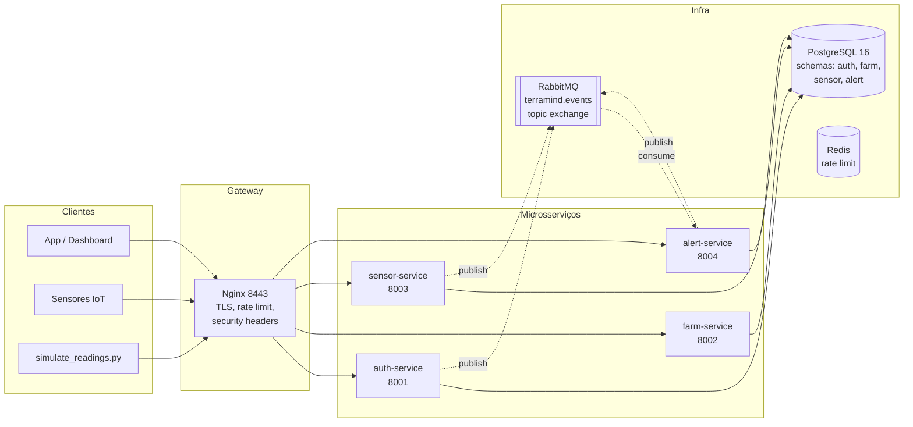

# Documento Arquitetural — Terramind

> FIAP — Global Solution 2026/1 — ODS 9
> Tema: Sistema de agricultura inteligente — monitoramento de produtividade e redução de perdas

## 1. Problema abordado

A perda de produtividade na agricultura é causada principalmente por:

- **Estresse hídrico** (excesso ou falta de umidade no solo);
- **Estresse térmico** (temperaturas fora da faixa ótima da cultura);
- **Eventos climáticos extremos** (chuvas intensas, geadas);
- **Detecção tardia** de qualquer um dos itens acima, pois a verificação manual
  em propriedades de centenas de hectares é lenta.

Sensores IoT já são viáveis comercialmente, mas a coleta sem um backend
que reaja em tempo real às leituras gera apenas planilhas — não decisões.

## 2. Objetivo da solução

Construir um backend de **monitoramento agrícola** que:

1. Receba leituras de sensores via API REST;
2. Mantenha catálogo estruturado de fazendas, talhões e culturas;
3. Avalie cada leitura contra os limites ótimos da cultura plantada;
4. Gere alertas com severidade (info/warning/critical) e os disponibilize
   para consulta com filtros (por talhão, severidade, resolvido ou não);
5. Mantenha rastreabilidade ponta a ponta para auditoria (LGPD, ISO 27001).

A solução é **agnóstica do hardware do sensor**: qualquer dispositivo capaz de
fazer um `POST` HTTP autenticado é compatível. O `scripts/simulate_readings.py`
demonstra essa interface.

## 3. Diagrama da arquitetura



Versão Mermaid também em [`diagrams/architecture.mmd`](diagrams/architecture.mmd).

## 4. Componentes do sistema

### 4.1 Gateway (Nginx)

Único ponto de entrada externo (porta 8443). Responsável por:
- Terminação TLS 1.2+ com HSTS;
- Rate limit global (30 req/s) e específico em `/auth/login` (5 req/min);
- Security headers (HSTS, X-Content-Type-Options, X-Frame-Options,
  Referrer-Policy, Permissions-Policy, CSP);
- Proxy para os 4 serviços via DNS interno do Docker (`auth-service:8001`, etc.);
- Propagação do header `X-Request-ID` para correlação de logs.

### 4.2 auth-service (porta 8001)

- Registro de usuários com hash bcrypt(SHA256 pre-hash);
- Login que emite par `access + refresh` (HS256);
- Rotação de refresh: ao consumir um refresh, ele é revogado e um novo par é emitido;
- `GET /auth/me` retorna o `Principal` extraído do JWT;
- `DELETE /auth/me` apaga o usuário (LGPD) — cascade nos `refresh_tokens`;
- Publica eventos `user.registered`, `user.logged_in`, `auth.failed` no barramento.

### 4.3 farm-service (porta 8002)

CRUD de três entidades relacionadas:
- **Farms**: propriedade do `owner_user_id` (extraído do JWT). Operações só
  permitidas ao dono ou a um admin.
- **Plots (talhões)**: subdivisão da fazenda; aponta para uma Crop opcional.
- **Crops (culturas)**: catálogo global gerenciado por admin. Carrega
  os limites ótimos (humidity/temperature) consumidos pelo alert-service.

Seed inicial contém: milho, soja, café, cana, algodão.

### 4.4 sensor-service (porta 8003)

- CRUD de Sensors (tipos: `soil_moisture`, `temperature`, `rainfall`, `npk`);
- Ingestão de Readings via `POST /sensor/sensors/{id}/readings`;
- A cada Reading persistida, publica `sensor.reading.recorded` no barramento;
- Consulta histórica com filtro `since` para construção de séries temporais.

### 4.5 alert-service (porta 8004)

- Consumer durável de `sensor.reading.recorded` (queue `alert-service.readings`);
- Cada leitura passa pelo `RuleEngine` com **regras globais por tipo de sensor**
  (umidade do solo, temperatura, pluviometria) cujos limiares vêm do `Settings`
  do serviço (env vars `FALLBACK_HUMIDITY_MIN/MAX`, `FALLBACK_TEMP_MIN/MAX`).
  Os valores atuais cobrem o envelope ótimo das culturas brasileiras de pequeno
  porte;
- Quando uma regra dispara, cria um `Alert` e publica `alert.triggered`;
- Expõe API de consulta com filtros (`plot_id`, `severity`, `resolved`);
- `PATCH /alerts/{id}/resolve` (agronomist+) marca alerta como resolvido e
  publica `alert.resolved`.

> **Decisão consciente:** o `RuleEngine` ainda **não consulta a `Crop`** associada
> ao talhão para ajustar limiares por cultura. Os schemas Postgres dos serviços
> são isolados, então a leitura cruzada exigiria uma das três alternativas:
> (a) HTTP call do consumer para `GET /farm/plots/{id}`, (b) replicação do
> catálogo `crops` via evento `crop.updated`, ou (c) compartilhamento de schema.
> Todas têm trade-offs; mantemos a separação estrita por enquanto e marcamos
> a integração como evolução prevista (ver `docs/discursive_questions.md` §2,
> item 5).

### 4.6 Pacote `terramind-shared`

Biblioteca compartilhada por todos os serviços. Concentra:

- `config.BaseServiceSettings`: leitura de `.env` com Pydantic Settings;
- `db.Base / Database / Mixins`: SQLAlchemy async + UUID + timestamps;
- `security.JWTService / hash_password / RBAC`: JWT HS256 + bcrypt + Role enum;
- `middleware.{request_id, security_headers, error_handler}`: middlewares Starlette;
- `events.{EventBus, schemas, signing}`: RabbitMQ topic exchange + HMAC-SHA256.

### 4.7 PostgreSQL

- Versão 16 com extensões `citext`, `uuid-ossp` e `pgcrypto`;
- **Um banco, quatro schemas**: `auth`, `farm`, `sensor`, `alert`. Cada serviço
  só vê o seu próprio schema; a alembic table fica nesse mesmo schema.
- Migrations gerenciadas independentemente por cada serviço via Alembic async.

### 4.8 RabbitMQ

- Topic exchange `terramind.events` durável;
- Cada mensagem JSON leva header `x-signature` com HMAC-SHA256;
- Consumers verificam a assinatura antes de processar — bloqueia
  eventos forjados (defesa em profundidade complementando a rede interna).

### 4.9 Redis

Atualmente reservado para rate limiting baseado em Redis caso seja necessário
ampliar além do Nginx (slowapi suporta backend Redis). Disponível como
infraestrutura, sem dependência forte ainda.

## 5. Fluxo básico da aplicação

### 5.1 Onboarding do produtor

```
1. POST /auth/register           → cria usuário (role=producer por default)
2. POST /auth/login              → retorna { access_token, refresh_token }
3. POST /farm/farms              → cria fazenda (owner_user_id derivado do JWT)
4. POST /farm/plots              → cria talhão associando uma Crop
5. POST /sensor/sensors          → instala sensor no talhão
```

### 5.2 Operação contínua (ingestão e alertas)

```
1. Sensor → POST /sensor/sensors/{id}/readings
2. sensor-service persiste Reading e publica `sensor.reading.recorded`
3. alert-service consome o evento, aplica regra e — se dispara — cria Alert
4. alert-service publica `alert.triggered`
5. Cliente consulta GET /alert/alerts?plot_id=...&resolved=false
6. Agronomista resolve: PATCH /alert/alerts/{id}/resolve → publica `alert.resolved`
```

## 6. Organização das camadas (todos os serviços)

```
{service}/src/{service}/
├── main.py             # FastAPI app factory, lifespan, routers
├── config.py           # Settings(BaseServiceSettings)
├── dependencies.py     # injeção: db session → repository → service
├── controllers/        # routers FastAPI: valida HTTP, retorna status codes
├── services/           # regras de negócio (sem dependência do FastAPI)
├── repositories/       # acesso a dados (async SQLAlchemy)
├── models/             # entidades SQLAlchemy
├── schemas/            # DTOs Pydantic (in/out)
└── migrations/         # Alembic
```

Princípios:
- **Controller** lida apenas com HTTP (decode payload, status codes, autorização básica);
- **Service** contém lógica de domínio e orquestra repositórios + eventos;
- **Repository** isola SQL/ORM — service nunca toca em `session.execute`;
- **Model ≠ Schema**: o ORM nunca cruza o boundary HTTP — sempre via DTO Pydantic.

## 7. Justificativa da arquitetura escolhida

| Decisão | Por quê |
|---|---|
| Microsserviços por subdomínio | Tema da matéria (SOA). Permite escalar `sensor-service` independentemente quando o volume de ingestão crescer. |
| FastAPI + Pydantic 2 | Tipagem forte, Swagger gratuito, async-first (essencial para alto volume de leituras). |
| uv workspace | Um único `uv sync` resolve todo o monorepo; cada serviço pode rodar isolado em Docker. |
| Schemas Postgres isolados por serviço | Defesa em profundidade contra acoplamento de dados entre serviços, mantendo um único banco para simplificar a operação acadêmica. |
| RabbitMQ + HMAC | Topic exchange é simples e suficiente para o volume; HMAC protege contra eventos forjados internamente sem precisar de mTLS. |
| Nginx como gateway | Adiciona TLS, rate limit e security headers sem precisar implementá-los em cada serviço. |
| JWT HS256 + refresh rotation | Segurança suficiente para escopo acadêmico, com TTL curto + rastreamento por JTI permitindo revogação real. |
| Workspace cross-platform | O projeto precisa rodar no Windows do avaliador; Docker Compose + scripts cross-OS (`scripts/tasks.py`) garantem `docker compose up` igual nos dois SOs. |
